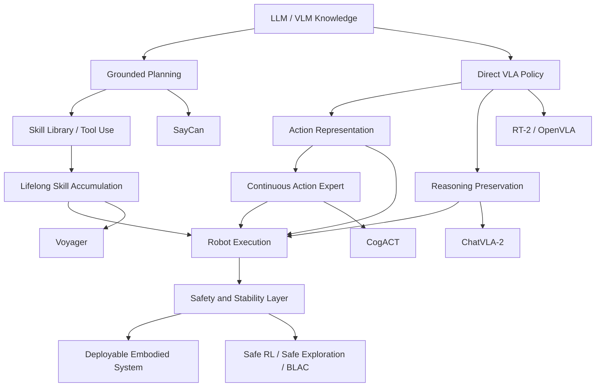

# VLA and Safe RL Paper Relationship Map

## Central Question

The papers answer one larger question from different angles:

> How can an embodied agent convert general knowledge into physically executable, reusable, and safe behavior?

The relationship is not linear. It is a stack:

## Paper Lineage

| Research move | Representative paper | What changed |
| --- | --- | --- |
| Ground LLMs with affordances | [[10-learning/Literature/Do As I Can Not As I Say - SayCan]] | Language chooses useful skills; value functions filter feasible skills. |
| Convert actions into tokens | [[10-learning/Literature/RT-2]] | VLMs become robot controllers by emitting action tokens. |
| Make VLA practical and open | [[10-learning/Literature/OpenVLA]] | Open 7B VLA, diverse robot demonstrations, efficient fine-tuning. |
| Improve action modeling | [[10-learning/Literature/CogACT]] | Specialized diffusion action transformer replaces simple direct action-token prediction. |
| Preserve pretrained reasoning | [[10-learning/Literature/ChatVLA-2]] | Mixture-of-experts and staged training reduce VLM capability loss after robot fine-tuning. |
| Accumulate reusable skills | [[10-learning/Literature/Voyager]] | LLM agent grows a skill library through code generation, feedback, and self-repair. |
| Add safety taxonomy | [[10-learning/Literature/A Review of Safe Reinforcement Learning]] | Organizes safe RL methods, constraints, guarantees, and deployment questions. |
| Correct unsafe actions | [[10-learning/Literature/Safe Exploration in Continuous Action Spaces]] | Safety layer projects continuous actions before constraint violation. |
| Combine safety and stability | [[10-learning/Literature/Stable and Safe Reinforcement Learning via BLAC]] | CBF + CLF constraints enter actor-critic learning. |

## Key Axes For Comparison

| Axis | SayCan | RT-2 | OpenVLA | CogACT | ChatVLA-2 | Voyager | Safe RL papers |
| --- | --- | --- | --- | --- | --- | --- | --- |
| Main unit | Skill | Action token | Open VLA policy | Diffusion action sequence | Reasoning-preserving VLA | Executable code skill | Constraint-aware action/policy |
| Generalization source | LLM semantics | Web VLM pretraining | Robot demos + VLM pretraining | VLM cognition + action expert | Preserved VLM knowledge | Skill library growth | Control constraints and guarantees |
| Strength | Interpretable grounding | Semantic transfer | Practical open baseline | Better action distribution | Open-world reasoning | Lifelong reuse | Deployment safety |
| Weakness | Fixed skills | Quantized actions | Imitation and safety gaps | Complexity and latency | Safety still external | Symbolic API dependence | Hard to scale to full VLA perception |

## Design Patterns You Can Reuse

### 1. Planner-Policy-Safety Decomposition

A robust embodied stack can combine multiple papers:

- Use [[10-learning/Literature/ChatVLA-2]]-style reasoning or a VLM for task interpretation.
- Use [[10-learning/Literature/Do As I Can Not As I Say - SayCan]]-style feasibility scoring to choose skills or subgoals.
- Use [[10-learning/Literature/CogACT]] or [[10-learning/Literature/OpenVLA]] as the action policy.
- Use [[10-learning/Literature/Safe Exploration in Continuous Action Spaces]] or [[10-learning/Literature/Stable and Safe Reinforcement Learning via BLAC]] as the safety layer.
- Use [[10-learning/Literature/Voyager]]-style skill storage to retain solved subtasks.

### 2. Action Representation Is The Hidden Bottleneck

The VLA papers are largely differentiated by action representation:

- SayCan avoids continuous action generation by selecting predefined skills.
- RT-2 and OpenVLA make actions compatible with language modeling through tokenization.
- CogACT argues that manipulation needs richer continuous action sequence modeling.
- Safe RL papers assume continuous actions and focus on keeping them within constraints.

When reading a new paper, first ask: **what is the action representation, and what physical detail does it lose?**

### 3. Reasoning Can Be Lost During Robot Fine-Tuning

RT-2 and OpenVLA show that web-scale knowledge can transfer to robot control. ChatVLA-2 asks the next question: after robot fine-tuning, does the model still retain the VLM's reasoning abilities?

This matters for tasks involving:

- OCR and symbolic marks.
- Spatial relations.
- Math-like matching.
- Novel object descriptions.
- Instructions requiring commonsense rather than memorized trajectories.

### 4. Safety Is Mostly Orthogonal To VLA Success

High manipulation success does not imply safety. VLA papers often optimize task completion, while safe RL papers optimize constraint satisfaction and stability.

For physical deployment, evaluate at least four metrics:

- Task success.
- Constraint violations.
- Recovery rate after bad states.
- Stability or boundedness of closed-loop behavior.

### 5. Skill Libraries Bridge Generalization And Reliability

Voyager and SayCan suggest that embodied systems should not solve every task from raw policy inference. A reusable skill library can:

- Make behavior interpretable.
- Reduce repeated exploration.
- Support repair and debugging.
- Provide a stable interface for safety filters.

## How To Read The Next Paper

Use this checklist:

- Is the paper solving planning, policy learning, action representation, reasoning retention, skill memory, or safety?
- Does it assume a fixed skill library, direct action output, or generated code?
- What data creates the capability: web data, robot demos, human videos, simulation, online feedback, or control constraints?
- What fails if the environment changes: objects, embodiment, camera, task horizon, contact dynamics, or safety constraints?
- Can the method be combined with another layer, or is it monolithic?

## Links

- [[10-learning/Literature/Embodied AI and Robotics Reading Synthesis]]
- [[10-learning/Literature/Literature Index]]
- [[20-ideas/Ideas Index|Embodied AI]]
- [[20-ideas/Ideas Index|Vision-Language-Action Models]]
- [[20-ideas/Ideas Index|Robotic Manipulation]]
